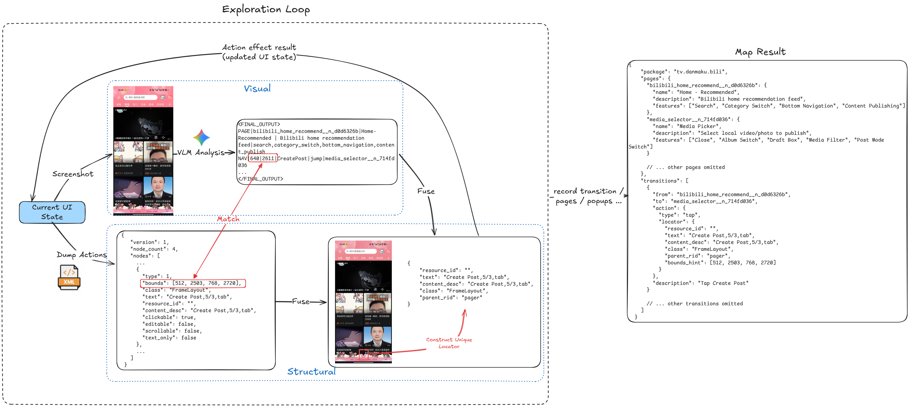
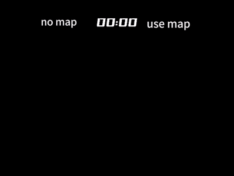

# LXB-MapBuilder

[English](README.md) | 中文

[LXB-Framework](https://github.com/wuwei-crg/LXB-Framework) 的独立建图工具。

LXB-MapBuilder 会驱动一台已经运行 `lxb-core` 的手机，自动探索 App 的页面跳转结构，并输出 JSON 导航地图。该地图会被 LXB-Framework 在运行时消费，用于实现确定性的无视觉页面路由。

## 工作原理

建图器运行的是一套 **VLM-XML Fusion** 探索循环：



1. **截图 + VLM 分析**：VLM 识别当前页面语义、可导航元素和阻塞弹窗。
2. **XML dump**：系统同步提取当前 UI 树中的可点击节点。
3. **包含匹配**：把 VLM 给出的坐标匹配到 XML 中最小可点击节点，必要时做 20 px 容错。
4. **Locator 构建**：为节点生成与坐标无关的定位器，降低分辨率和布局波动带来的影响。
5. **从首页重放**：每次点击后回到首页，再按路径重放到下一个待探索节点，保证状态稳定。



最终输出的地图 JSON 主要包含四部分：`pages`、`transitions`、`popups`、`blocks`。

## 环境要求

- Python 3.10+
- 手机已安装 [LXB-Framework](https://github.com/wuwei-crg/LXB-Framework)，并且已经成功启动 `lxb-core`
- 运行 `web_console` 的电脑与手机处于同一局域网
- 在 Web Console 中配置好兼容 OpenAI 接口格式的 VLM 服务

## 快速开始

### 1. 先准备手机侧环境

1. 在手机上安装 LXB-Framework。
2. 在手机端完成首次配对和启动流程。
3. 在手机上启动 `lxb-core`，并保持其运行。
4. 确保手机和电脑连接到同一个局域网。
5. 确认手机侧 `lxb-core` 的监听端口，默认一般是 `12345`。

### 2. 启动 Web Console

```bash
cd web_console
pip install -r requirements.txt   # 首次使用
python app.py
```

浏览器打开 `http://localhost:5000/`。

### 3. 用局域网连接手机

1. 在连接面板中输入手机 IP 和 `lxb-core` 端口。
2. 点击 **Connect**。
3. 状态变为已连接后，后续建图动作都会通过这条局域网连接发送到手机侧 core。

当前建图的正常使用方式不是 ADB 直连，而是 `web_console` 通过局域网 TCP 连接手机上的 `lxb-core`。

### 4. 开始建图

1. 选择目标应用包名。
2. 在 Web Console 中配置 VLM 的接口地址、API Key 和模型名。
3. 设置最大页面数、探索深度等参数。
4. 点击 **Start** 开始自动探索。
5. 在内置 Map Viewer 中检查生成结果。
6. 导出地图 JSON，并发布到 [LXB-MapRepo](https://github.com/wuwei-crg/LXB-MapRepo)。

## 使用建议

- 尽量在目标 App 已登录、弹窗已清理、可正常使用的状态下开始建图。
- 如果 App 开屏广告、活动弹窗较多，通常需要多跑几次才能覆盖完整路径。
- 建议先发布到 MapRepo 的 `candidates`，真机验证稳定后再提升到 `stable`。

## 相关仓库

- [LXB-Framework](https://github.com/wuwei-crg/LXB-Framework)：手机侧运行框架
- [LXB-MapRepo](https://github.com/wuwei-crg/LXB-MapRepo)：导航地图产物仓库
